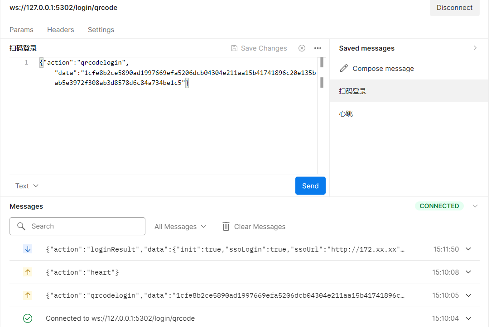

# 1、获取登录id

http get http://127.0.0.1:5302/login/getLoginId

# 2、PC端webSocket连接到服务端

ws://127.0.0.1:5302/login/qrcode

##     2.1、定时发送 心跳保持连接

{"action":"heart"} 	

##     2.2、发起待扫码登录 

{"action":"qrcodelogin","data":"1cfe8b2ce5890ad1997669efa5206dcb04304e211aa15b41741896c20e135bab5e3972f308ab3d8578d6c84a734be1c5"}
   	刷新了二维码重新获取登录id并发起待扫码登录

# 2、移动端扫码获得loginid,并校验loginid合法性

http get http://127.0.0.1:5302/login/valideLoginId?uuid=d3cd4a9ff1db20688ba8fe41fa7eacd7d91285e3b17d72ebff15145396f0848c9b02f611b4d9c24a0799aebe8e4a65ee

# 3、移动端与PC页面互动

调用其他业务接口后确认是否需要单点登录，推送单点登录地址到PC。
ssoLogin=true表示确认登录，ssoLogin=false表示取消登录
init=true表示已扫描二维码
http post http://127.0.0.1:5302/login/confirmLogin?uuid=d3cd4a9ff1db20688ba8fe41fa7eacd7d91285e3b17d72ebff15145396f0848c9b02f611b4d9c24a0799aebe8e4a65ee
requestbody
{
"init":true,
"ssoLogin":true,
"ssoUrl":"http://172.xx"
}

PC 收到消息
{"action":"loginResult","data":{"init":true,"ssoLogin":true,"ssoUrl":"http://172.xx"}}

